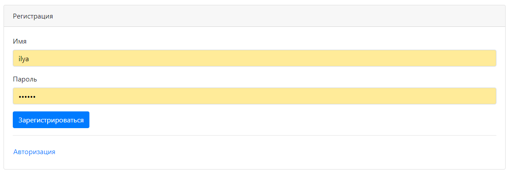
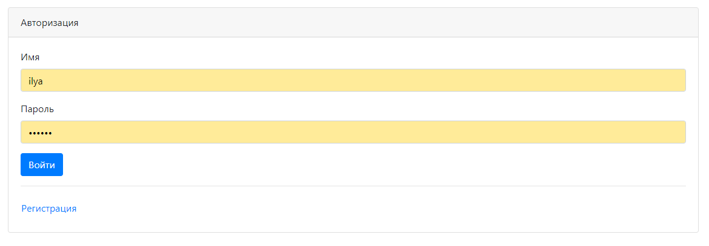
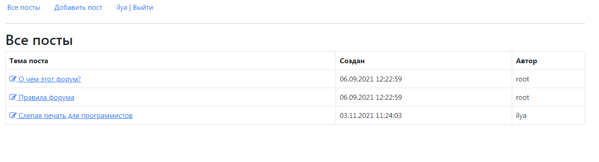
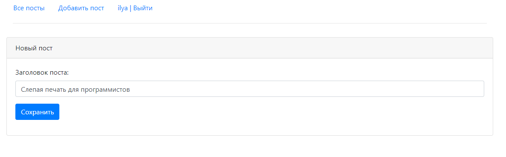
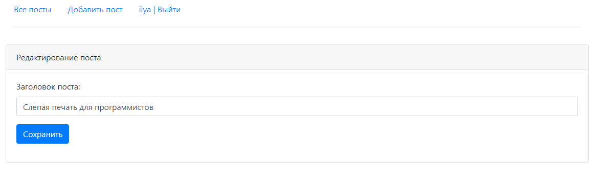
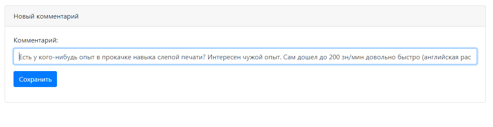
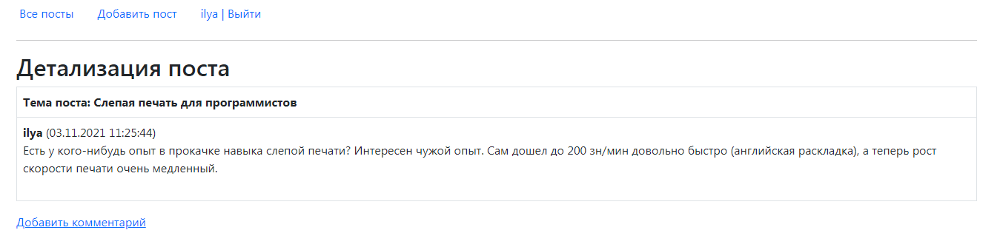
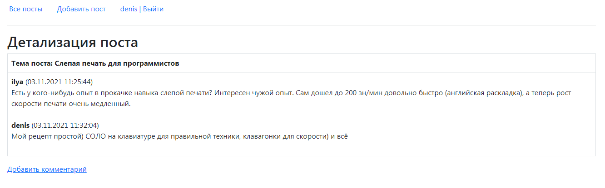

Проект "Форум"
=========================================

**О проекте:**

Проект для изучения Spring Boot.
Проект предназначен для знакомства со Spring Boot.
Данное приложение представляет собой простую реализацию форума. 
Пользователи могут добавлять новые темы на форуме, редактировать их и оставлять комментарии в своих и чужих темах. 
Также в приложении есть регистрация и авторизация.

**Используемые технологии:**
- Java 12
- Spring Boot(Data, Security, Test), JSP, JSTL
- PostgreSQL
- Maven
- Heroku

**Пользовательский интерфейс:**

Регистрация пользователя

Авторизация пользователя

Отображение всех тем форума

Добавление новой темы

Редактирование темы

Добавление комментария

Детализация темы форума после добавления комментария

Детализация темы форума, все комментарии

**Контакты:**

